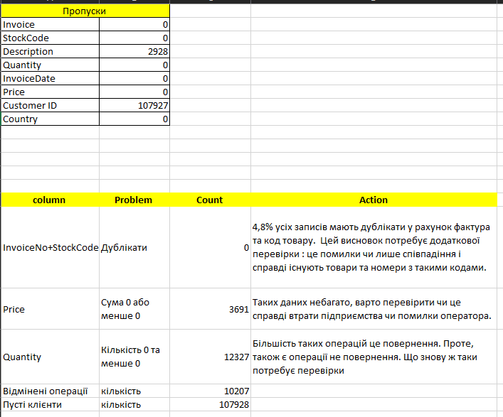

# ecommerce-data-cleaning
Data cleaning and analysis of e-commerce transactions
-------
# E-commerce Data Cleaning & Analysis

Data cleaning and analysis of real e-commerce transactional data (500K+ records), including a data quality audit and an interactive Excel dashboard.

## 📊 Dataset

[UCI Online Retail II](https://archive.ics.uci.edu/dataset/502/online+retail+ii) — transactional data from a UK-based online retailer. This project uses the "Year 2009-2010" sheet (525,462 rows, 8 columns).

Full source details: [data/source_link.md](data/source_link.md)

## 🎯 Objective

Clean raw transactional data, identify and document data quality issues, and build an analytical dashboard with key business metrics.

## 🛠 Tools

Excel: Pivot Tables, PivotCharts, Data Validation, Conditional Formatting, formulas (SUMIFS, COUNTIF, COUNTIFS)

## 🔍 Data Quality Report

Identified and analyzed:

| Issue | Count | % of records |
|---|---|---|
| Missing CustomerID | 107,927 | 20.5% |
| Missing Description | 2,928 | 0.6% |
| Duplicate InvoiceNo + StockCode | 25,401 | 4.8% |
| UnitPrice ≤ 0 | 3,691 | 0.7% |
| Quantity ≤ 0 | 12,327 | 2.3% |
| Documented cancellations (InvoiceNo starting with "C") | 10,207 | 1.9% |

Full report: [documentation/data_quality_report.md](documentation/data_quality_report.md)

## 🧹 Data Cleaning

Created a new `clean_data` sheet with additional columns:
- **Cancelled** — flag for cancelled orders (InvoiceNo starts with "C")
- **Revenue** — calculated as `Quantity × UnitPrice`

Rather than deleting problematic rows outright, each issue was flagged and documented, preserving the ability to include or exclude them depending on the analysis.

## 📈 Dashboard

**Key metrics:**
- Total Revenue: £9,539,484
- Total Orders: 28,818
- Total Customers: 4,385
- Average Order Value: £331.03

**Includes:**
- Revenue by Country (Pivot Table + chart)
- Revenue by Month (Pivot Table + chart)
- Top 10 Products by Revenue
- Country filter (dropdown via Data Validation)

## 💡 Business Insights

- The United Kingdom accounts for the vast majority of revenue (~86%)
- Sales peak in November-December, consistent with pre-holiday demand
- Top-performing product by revenue: REGENCY CAKESTAND 3 TIER (£163K)

## 📁 Repository Structure
ecommerce-data-cleaning/
├── README.md
├── data/
│ └── source_link.md
├── excel/
│ └── ecommerce_analysis.xlsx
├── screenshots/
│ ├── data_quality_report.png
│ ├── summary_dashboard.png
│ └── pivot_charts.png
└── documentation/
└── data_quality_report.md

## 🔗 File

[ecommerce_analysis.xlsx](excel/ecommerce_analysis.xlsx)
